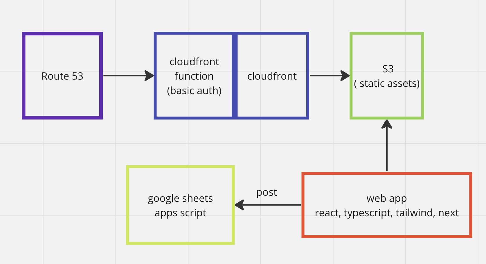

This is a [Next.js](https://nextjs.org/) project bootstrapped with [`create-next-app`](https://github.com/vercel/next.js/tree/canary/packages/create-next-app).

## Getting Started

First, run the development server:

```bash
npm run dev
# or
yarn dev
# or
pnpm dev
# or
bun dev
```

Open [http://localhost:3000](http://localhost:3000) with your browser to see the result.

You can start editing the page by modifying `app/page.tsx`. The page auto-updates as you edit the file.

This project uses [`next/font`](https://nextjs.org/docs/basic-features/font-optimization) to automatically optimize and load Inter, a custom Google Font.

## Learn More

To learn more about Next.js, take a look at the following resources:

- [Next.js Documentation](https://nextjs.org/docs) - learn about Next.js features and API.
- [Learn Next.js](https://nextjs.org/learn) - an interactive Next.js tutorial.

You can check out [the Next.js GitHub repository](https://github.com/vercel/next.js/) - your feedback and contributions are welcome!

## Deploy on Vercel

The easiest way to deploy your Next.js app is to use the [Vercel Platform](https://vercel.com/new?utm_medium=default-template&filter=next.js&utm_source=create-next-app&utm_campaign=create-next-app-readme) from the creators of Next.js.

Check out our [Next.js deployment documentation](https://nextjs.org/docs/deployment) for more details.

## System Diagram


## Helper Utilities
- favicon creator
    - https://favicon.io/favicon-generator/
    
## TODO
- Deployment 
- Immediate fixes
    - double-click is needed to open the welcome letter ( sometimes ) 
- Features
    - add information icon to form post to inform users of where the data is going
    - e2e tests (improve)
- Text Content
    - our story 
    - do we still need "additional festivities to be announced?" 
    - bridal party "where we met" sections
    - lodging 
    - things to do 
    - registry modal content
- Optimizations
    - images
        - reduce sizes to minimum
- UI/Style Improvements
    - normalize margin/padding between sections and content in general
    - consider fonts that will match save the dates
    - move Reid & Brittany intro text above our heads
    - change Brittanys headshot
    - fix padding for breakpoint ( desktop ) of brittany and reid intro 
    - verify things work on desktop
        - fix burger expanded menu
        - center align checkboxes in form
- Image optimization
    - lazy/loading 
    - optimize images using a build utility ( i.e. vite image compression )
- Observations/Analysis
    - integrate https://logrocket.com/